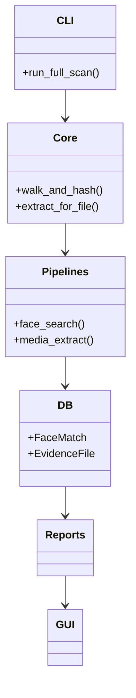

```mermaid
classDiagram
    class CLI {
        +run_full_scan()
    }
    class Core {
        +walk_and_hash()
        +extract_for_file()
    }
    class Pipelines {
        +face_search()
        +media_extract()
    }
    class DB {
        +FaceMatch
        +EvidenceFile
    }
    CLI --> Core
    Core --> Pipelines
    Pipelines --> DB
    DB --> Reports
    Reports --> GUI
```