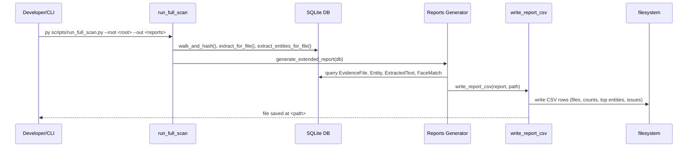

```mermaid
sequenceDiagram
    participant Dev as Developer/CLI
    participant Run as run_full_scan
    participant DB as SQLite DB
    participant Report as Reports Generator
    participant CSV as write_report_csv

    Dev->>Run: py scripts/run_full_scan.py --root <root> --out <reports>
    Run->>DB: walk_and_hash(), extract_for_file(), extract_entities_for_file()
    Run->>Report: generate_extended_report(db)
    Report->>DB: query EvidenceFile, Entity, ExtractedText, FaceMatch
    Report->>CSV: write_report_csv(report, path)
    CSV->>filesystem: write CSV rows (files, counts, top entities, issues)
    CSV-->>Dev: file saved at <path>
```